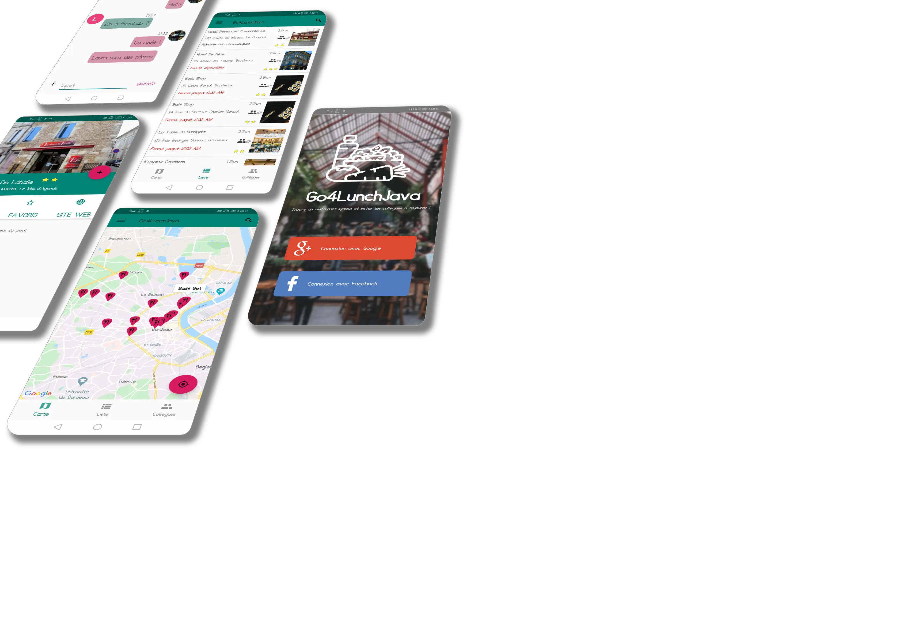

<h1 align="left">Go4Lunch</h1>

Last updated on 17 Jan 2020

<h4>Go4Lunch is an android application allowing users to organize their meals during lunch break to meet around a good dish!</h4>

___

## Technical features

- **Java 8**
- **MVVM** architecture
- API requests with **Retrofit**
- **Notifications** via **WorkManager**
- **FireBase** remote server data storage
- **Facebook & Google sign-in**
- Selective update of a RecyclerView via **RecyclerView.ListAdapter**
